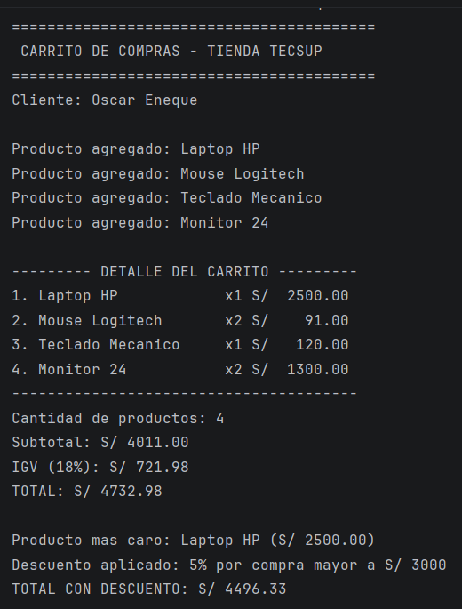

## Kotlin

Estudiante: Oscar Armando Eneque Lluen

Descripción: Lo que realice fue simular un carrito de compras. Las funciones son que permite ver los productos registrados(nombre, precio, cantidad), calcular el subtotal, el IGV y luego el total a pagar. Tambien modificar algunso detalles del carrito con columnas alineadas, ver el producto mas caro y aplicar un descuento, segun el monto total.
Funciones que hice: calcularSubtotal, calcularIGV, calcularTotal, mostrarDetalle, calcularDescuento.

## Análisis: val vs var

nombre y precio son val porque son datos que no deberían cambiar una vez creado el producto. en cambio, cantidad es var porque el usuario sí puede modificar cuántas unidades lleva de ese producto en el carrito.

Si se intenta cambiar el precio, entonces el compilador marca el error "Val cannot be reassigned", porque val crea una referencia inmutable.